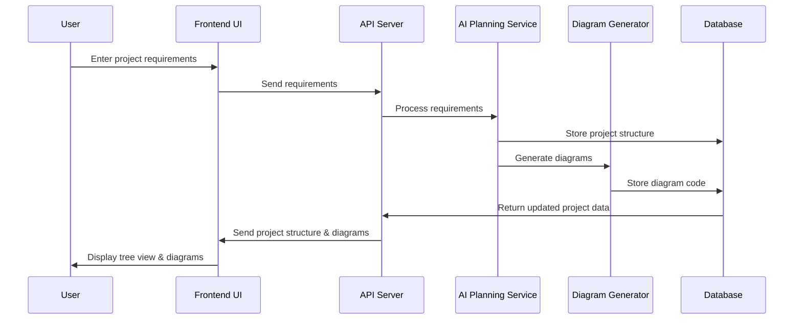
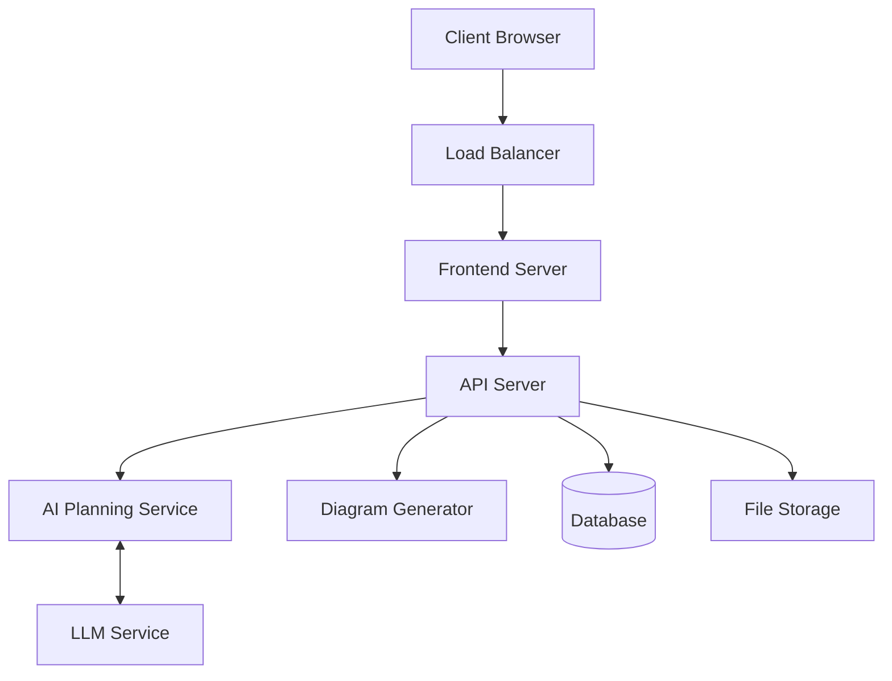

# Technical Architecture

## System Components

### 1. Frontend Application

The frontend will be a Next.js application with the following key components:

#### UI Components
- **Layout Component**: Manages the overall application layout
  - Header (navigation, user info, project selector)
  - Sidebar (tree structure view)
  - Main Content Area (diagram view with tabs)
  - Footer (chat interface)

- **Tree View Component**: 
  - Hierarchical display of project structure
  - Node expansion/collapse functionality
  - Context menus for node operations
  - Drag-and-drop for restructuring

- **Diagram Component**:
  - Tab management for multiple diagrams
  - Mermaid.js integration for rendering diagrams
  - Zoom and pan controls
  - Export functionality

- **Chat Interface Component**:
  - Message history display
  - Input area with autocomplete
  - File attachment support
  - Markdown rendering for responses

#### State Management
- React Context API for application state
- Redux for complex state management
- WebSocket connection for real-time updates

### 2. Backend Services

#### API Server (Node.js/Express)
- RESTful API endpoints for CRUD operations
- Authentication and authorization
- WebSocket server for real-time communication
- File storage and management

#### AI Planning Service (Python)
- Integration with LLMs (OpenAI, Anthropic, etc.)
- Planning algorithms from PlanGen
- Project structure generation
- Task breakdown and estimation

#### Diagram Generation Service (Python)
- Natural language to diagram conversion
- Mermaid.js code generation
- Diagram optimization and layout
- Multiple diagram type support

### 3. Data Storage

#### Database
- MongoDB for document storage
- PostgreSQL for relational data
- Redis for caching and real-time features

#### File Storage
- S3-compatible storage for assets
- Version control for project files

## Communication Flow

## Integration Points

### GitDiagram Integration
- Use GitDiagram's diagram generation capabilities
- Extend with project-specific diagram types
- Integrate with version control systems

### PlanGen Integration
- Leverage planning algorithms for project structure
- Use verification mechanisms for plan validation
- Extend with domain-specific planning capabilities

### Clean-Coder-AI Integration
- Utilize project management features
- Integrate task tracking and assignment
- Leverage code generation capabilities

### Plandex Integration
- Use project planning features
- Integrate with implementation planning
- Leverage code structure analysis

## Deployment Architecture

## Security Considerations

1. **Authentication & Authorization**
   - JWT-based authentication
   - Role-based access control
   - API key management for service-to-service communication

2. **Data Protection**
   - Encryption at rest and in transit
   - Regular backups
   - Data retention policies

3. **API Security**
   - Rate limiting
   - Input validation
   - CORS configuration

## Scalability Considerations

1. **Horizontal Scaling**
   - Stateless API servers
   - Load balancing
   - Containerization with Kubernetes

2. **Performance Optimization**
   - Caching strategies
   - Database indexing
   - Asynchronous processing for intensive operations

3. **Resource Management**
   - Efficient LLM usage
   - Diagram rendering optimization
   - Background processing for non-interactive tasks