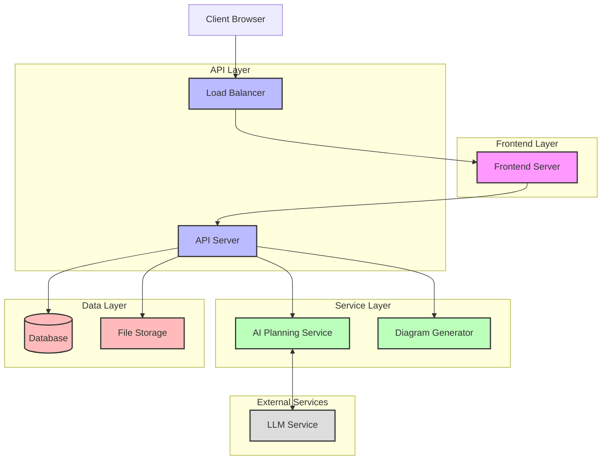
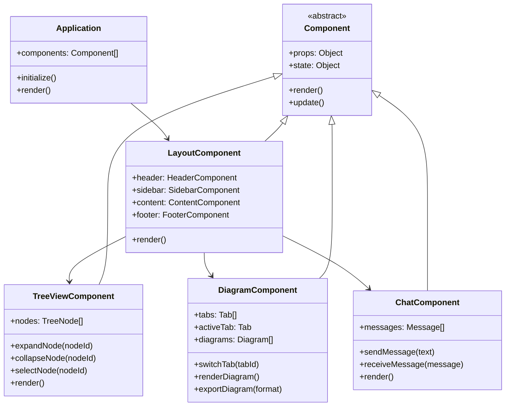

# UI Mockups

## Main Application Layout

```
+-------------------------------------------------------+
|                       Header                          |
+---------------+---------------------------------------+
|               |                                       |
|               |                                       |
|               |                                       |
|  Tree         |  Diagram View (Tabbed Interface)     |
|  Structure    |                                       |
|  View         |                                       |
|               |                                       |
|               |                                       |
|               |                                       |
+---------------+---------------------------------------+
|                                                       |
|                  Chat Interface                       |
|                                                       |
+-------------------------------------------------------+
```

## Tree Structure View

The tree structure view will display the project hierarchy in an expandable/collapsible format:

```
Project Name
├── Frontend
│   ├── Components
│   │   ├── Header
│   │   ├── Sidebar
│   │   ├── Main Content
│   │   └── Footer
│   ├── Pages
│   │   ├── Home
│   │   ├── Dashboard
│   │   └── Settings
│   └── State Management
│       ├── Context
│       └── Redux Store
├── Backend
│   ├── API Endpoints
│   │   ├── User Management
│   │   ├── Project Management
│   │   └── Data Services
│   ├── Database Models
│   │   ├── User
│   │   ├── Project
│   │   └── Diagram
│   └── Services
│       ├── Authentication
│       ├── Planning
│       └── Diagram Generation
└── Deployment
    ├── Development
    ├── Staging
    └── Production
```

## Diagram View with Tabs

The diagram view will feature a tabbed interface for different diagram types:

```
+-------------------------------------------------------+
| [Architecture] [Components] [Sequence] [Data Model] + |
+-------------------------------------------------------+
|                                                       |
|                                                       |
|                                                       |
|                                                       |
|                 Diagram Content                       |
|                                                       |
|                                                       |
|                                                       |
|                                                       |
+-------------------------------------------------------+
| Zoom: [--------O--------] | Export: [PNG] [SVG] [URL] |
+-------------------------------------------------------+
```

### Sample Architecture Diagram (Mermaid.js)



### Sample Component Diagram (Mermaid.js)



## Chat Interface

The chat interface will be located at the bottom of the screen:

```
+-------------------------------------------------------+
| [AI] Hello! How can I help with your project today?   |
|                                                       |
| [User] I need to create a web application for         |
| inventory management.                                 |
|                                                       |
| [AI] I'll help you plan that. Let me create a basic   |
| project structure and some diagrams for you.          |
|                                                       |
| [System] Creating project structure...                |
| [System] Generating architecture diagram...           |
+-------------------------------------------------------+
| Type your message...                        [Send] [↑]|
+-------------------------------------------------------+
```

## Mobile View

On mobile devices, the layout will adapt to a tabbed interface:

```
+-------------------------------------------------------+
|  Project Name                              [≡] [👤]  |
+-------------------------------------------------------+
| [Tree] [Diagram] [Chat]                               |
+-------------------------------------------------------+
|                                                       |
|                                                       |
|                                                       |
|                                                       |
|                 Current Tab Content                   |
|                                                       |
|                                                       |
|                                                       |
|                                                       |
+-------------------------------------------------------+
```

## Context Menu for Tree Nodes

Right-clicking on a tree node will display a context menu:

```
+------------------------+
| ✏️ Edit                |
| 🔍 View Details        |
| 📊 Create Diagram      |
| 📋 Add Child Node      |
| 🗑️ Delete              |
| 📋 Copy                |
| 📋 Paste               |
+------------------------+
```

## Diagram Tab Context Menu

Right-clicking on a diagram tab will display a context menu:

```
+------------------------+
| 📋 Duplicate Tab       |
| 🔄 Refresh Diagram     |
| 💾 Export Diagram      |
| 🔍 View Mermaid Code   |
| 🗑️ Close Tab           |
+------------------------+
```